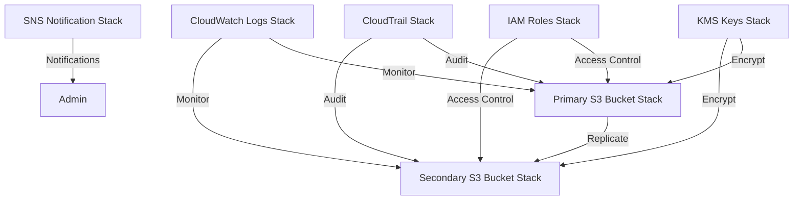

# Secure Document Management System Backend with Regulatory Compliance

Author: Dimitri Vavoulis

## Project Overview

This project implements a highly secure and compliant document management system backend using AWS CloudFormation stacks. It's designed to meet stringent federal file management laws and showcases best practices in cloud architecture, security, and regulatory compliance. The entire infrastructure is defined as code, with no manual development or configuration required.

## Features

- Fully automated deployment using AWS CloudFormation
- Dual-bucket system for enhanced security (Primary and Secondary buckets)
- Server-side encryption using AWS KMS
- Cross-region replication for disaster recovery
- Comprehensive access controls using IAM roles
- Audit logging with AWS CloudTrail
- Monitoring and alerting with CloudWatch and SNS
- Cost management alerts

## Architecture



## Security Measures

- All data encrypted at rest using AWS KMS (defined in KMS Keys Stack)
- Secure transit using SSL/TLS (enforced by S3 configurations)
- Strict IAM roles and policies following the principle of least privilege (defined in IAM Roles Stack)
- Multi-factor authentication for admin access (enforced by IAM policies)
- Regular security audits via CloudTrail (set up in CloudTrail Stack)

## Compliance

This system is designed to comply with various federal file management laws and regulations, including:

- Federal Information Security Management Act (FISMA)
- Health Insurance Portability and Accountability Act (HIPAA)
- General Data Protection Regulation (GDPR)

Compliance is ensured through the combination of security measures, access controls, and audit logging implemented across the various stacks.

# Secure Document Management System Backend with Regulatory Compliance

## Deployment

This project uses AWS CloudFormation for infrastructure as code. To deploy the entire system:

1. Ensure you have AWS CLI configured with appropriate permissions.

2. Download the ZIP file containing all the CloudFormation stack templates from the project repository.

3. Extract the ZIP file to a local directory.

4. Update the placeholders in the `master-stack.yaml` file:
   - Replace the S3 bucket URL placeholders with the URL of the S3 bucket where you'll upload the templates.

5. Create an S3 bucket to host the CloudFormation templates:
   ```
   aws s3 mb s3://your-cfn-templates-bucket-name
   ```

6. Upload all the CloudFormation templates to the S3 bucket:
   ```
   aws s3 sync . s3://your-cfn-templates-bucket-name/secure-doc-management/ --exclude "*" --include "*.yaml"
   ```

7. Deploy the CloudTrail stack first (as it's a prerequisite for auditing):
   ```
   aws cloudformation create-stack --stack-name secure-doc-management-cloudtrail --template-url https://your-cfn-templates-bucket-name.s3.amazonaws.com/secure-doc-management/cloudtrail-stack.yaml --capabilities CAPABILITY_IAM
   ```

8. Once the CloudTrail stack is created, deploy the master stack, which will create all other nested stacks:
   ```
   aws cloudformation create-stack --stack-name secure-doc-management --template-url https://your-cfn-templates-bucket-name.s3.amazonaws.com/secure-doc-management/master-stack.yaml --capabilities CAPABILITY_IAM
   ```

9. After all nested stacks are created, deploy the primary bucket stack:
   ```
   aws cloudformation create-stack --stack-name secure-doc-management-primary-bucket --template-url https://your-cfn-templates-bucket-name.s3.amazonaws.com/secure-doc-management/primary-bucket-stack.yaml --capabilities CAPABILITY_IAM
   ```

10. Monitor the stack creation process in the AWS CloudFormation console or using the AWS CLI:
    ```
    aws cloudformation describe-stacks --stack-name secure-doc-management
    ```

Note: Ensure that you have the necessary permissions to create these resources in your AWS account. You may need to customize the stack names and parameters based on your specific requirements.

## Project Structure

All components of this system are defined as CloudFormation stacks:

- `cloudtrail-stack.yaml`: Configures CloudTrail for comprehensive audit logging
- `master-stack.yaml`: Main CloudFormation template that orchestrates the creation of all other stacks except `cloudtrail-stack.yaml` and `primary-bucket-stack.yaml`
- `iam-roles-stack.yaml`: Defines IAM roles and policies for secure access control
- `kms-keys-stack.yaml`: Sets up KMS keys for encryption of data at rest
- `secondary-bucket-stack.yaml`: Creates and configures the secondary S3 bucket for replication
- `cloudwatch-logs-stack.yaml`: Sets up CloudWatch logs for monitoring and alerting
- `sns-notification-stack.yaml`: Configures SNS for alerting and notifications
- `primary-bucket-stack.yaml`: Creates and configures the primary S3 bucket

## Stack Details

### Master Stack
- Coordinates the creation and dependencies of all other stacks
- Ensures proper sequencing of resource creation

### IAM Roles Stack
- Defines a GlobalAccessRole with specific permissions for S3 operations
- Ensures principle of least privilege in access control

### KMS Keys Stack
- Creates separate KMS keys for primary and secondary buckets
- Enables automatic key rotation for enhanced security
- Defines key policies to restrict usage to authorized entities only

### Primary Bucket Stack
- Configures the main S3 bucket with versioning and encryption
- Sets up replication to the secondary bucket
- Implements bucket policies for secure access

### Secondary Bucket Stack
- Configures a separate S3 bucket for data replication
- Implements similar security measures as the primary bucket
- Sets up appropriate permissions for receiving replicated data

### CloudTrail Stack
- Sets up a trail to log API activities across the AWS infrastructure
- Configures log file integrity validation
- Enables multi-region trail for comprehensive coverage

### CloudWatch Logs Stack
- Configures log groups for monitoring S3 bucket activities
- Sets up metric filters and alarms for detecting unusual activities
- Defines retention policies for log data

### SNS Notification Stack
- Sets up an SNS topic for various system alerts
- Configures a CloudWatch alarm to monitor estimated charges
- Defines subscription protocols and endpoints for notifications

## Future Enhancements

- Implement more granular access controls using S3 bucket policies
- Add data lifecycle management policies within the S3 bucket stacks
- Integrate with AWS Config for continuous compliance monitoring
- Expand CloudFormation templates to include additional security services like AWS WAF and Shield

## Contributing

While this is primarily a portfolio project, suggestions and improvements are welcome. Please open an issue to discuss proposed changes.

## License

This project is licensed under the MIT License - see the [LICENSE.md](LICENSE.md) file for details.

## Contact

Dimitri Vavoulis - dimitrivavoulis3@gmail.com

Project Link: [https://github.com/DimitriVavoulisPortfolio/aws-secure-document-management-backend-with-regulatory-compliance](https://github.com/DimitriVavoulisPortfolio/aws-secure-document-management-backend-with-regulatory-compliance)

---

This project was developed as part of a professional portfolio to demonstrate expertise in cloud architecture, security, and regulatory compliance in AWS environments, with a focus on infrastructure-as-code using AWS CloudFormation.
